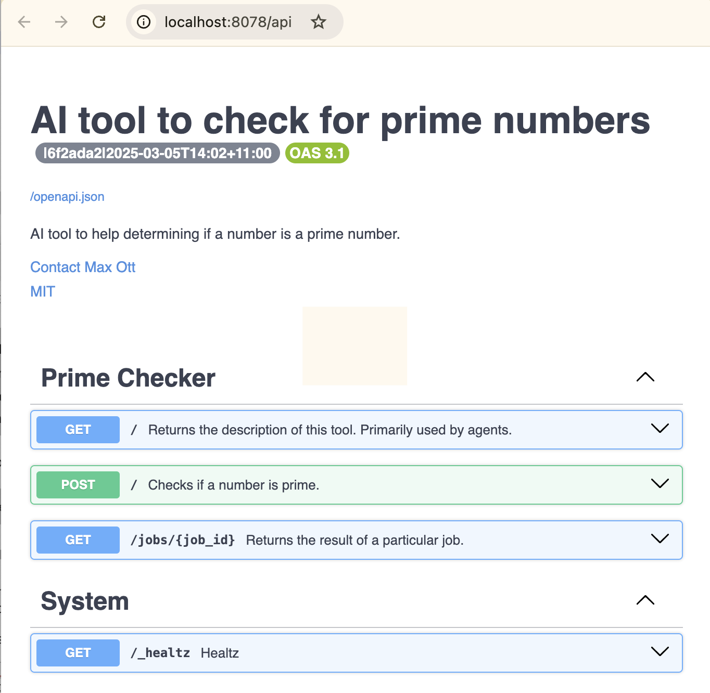

# Sciansa Tool Integration

If you are new to development for Sciansa see https://github.com/csiro-internal/sciansa-integration for higher level
topics.

This repositiory focuses on integrating an existing tool that you want to make avilable from the Sciansa platform.

This is the most basic beginner tutorial (akin to Hello World!). If you want a more advanced tutorial see the additional
tutorials listed here https://github.com/csiro-internal/sciansa-integration?tab=readme-ov-file#further-reading .

Particularly note the [Common Issues](#common-issues) section of this document. It provides a searchable set of issues
that people typically run into when they are trying this tutorial for the first time.

**Quick Start:** Jump straight to [Local Development and Testing](#local-development-and-testing).


# Design

Before integrating your tool into Sciansa make sure you consider how your tool will fit into the system architecture.
Ultimately Sciansa is a modular system with each unit having inputs and outputs. How well you define your tools
abstraction and what you choose as the inputs and outputs for your tool module will effect how useful your tool is
within the Sciansa ecosystem. Higher level modular design principles can be found in
[https://github.com/csiro-internal/sciansa-integration](https://github.com/csiro-internal/sciansa-integration).


# Beginners

If you are just starting out it is recommended that you use this repository as a template to guide your development.
This repository is a GitHub template that you can use as the starting point for your new integration (copying in the
working example as the starting point for your new integration). On GitHub you can select "Use this template" ->
"Create a new repository", which will create a new repository with all of the files copied in from this repository.

This guide targets developers who want to integrate classical tools with well defined inputs and outputs. If you want to
support an agent interaction pattern see the
[Hybrid section in the Sciansa Integration Docs](https://github.com/csiro-internal/sciansa-integration?tab=readme-ov-file#hybrid-advanced).


# Assessing Integration Complexity

The following list will help you to identify how complex it will be to integrate your tool with Sciansa:

**Familiarity with Technologies Used** \
How familiar are you with the technologies listed in the [Technologies](#technologies) section? \
We are still working to understand our developer users better. Please let us know which technologies you are and aren't
familiar with so that we can improve our developer experience.

**Dependencies:** \
How well do you understand your dependencies? Have you tried to put your technology in a Docker container? \
Tools with well understood dependencies or have been containerised before are easier to integrate.

How big are your dependencies? \
This include everything that needs to be packaged to make your tool work (everything beyond the inputs and outputs).

**Dependency Compatibility:** \
Is the tool compatible with the Sciansa dependency set? See: [Technologies](#technologies) \
Identify any significant incompatibilities between the dependencies used by Sciansa and the technologies that you use.

**State:** \
Does the tool maintain an internal state or is it stateless? \
Stateless tools are easier to integrate then tools that require state preservation between calls.

**Resources:** \
What are the compute resources required? \
If your tool requires substantial compute or GPU resources talk with the Sciansa team in the first instance to see if
your compute requirements can be accommodated by the platform.

**Inputs and Outputs:** \
What are the expectations on the Inputs and Outputs for your tool? \
What is the order of magnitude of data required as inputs and outputs for your tool(s) and where are they stored? \
Tools that can accommodate inputs and outputs in standardised formats and that can be written to take these inputs and
outputs as parameters (rather than hard coded files) are easier to integrate.

**Configuration:** \
How is the tool configured? \
Are you able to supply a set of parameters or does the tool have a GUI or interactive workflow? \
Tools that can be configured up front without requiring further interaction are easier to integrate then tools that
need supervisory interactive configuration patterns.

**Extend This List:** \
Thought that your tool would be easy to integrate based on the above list and then found it harder then you expected? \
Please reach out for help and support. \
Also, please make update this list to reflect the additional constraints that made the integration more complex.


# Technologies

The following matrix defines the technologies you will need to use to integrate your tool. If you are starting from
scratch it is recommended that you use the default options. If you are integrating an existing tool the matrix
highlights compatibility.

Type                     | Technology |
-------------------------|------------|
Source Code Management   | Git        |
Language                 | Python     |
Dependency Management    | Poetry     |
Build System             | Poetry     |
Deployment               | Docker     |
Infrastructure Framework | IVCAP      |
Library                  | Pydantic   |


IVCAP is the backend infrastructure that all Sciansa modules run on. If you have some familiarity with cloud
infrastructure, IVCAP is a technology abstraction over the native cloud infrastructure.

If you are not familiar with IVCAP the best brief introduction can be found in the IVCAP section of the [Sciansa
Developer Documentation](https://github.com/csiro-internal/sciansa-integration#IVCAP-quick-start).


# Local Development and Testing

We start by building the template "as is" to verify the development environment and start in a known good working state.
Once you understand how to build, deploy and interact with the service (provide inputs and retrieve outputs - both
locally and on the deployed instance) you can progressively customise the template with your functionality.


## Install Development Dependencies:

After installing the dependencies listed below you should be able to run the commands provided (in the "Test Install"
section) to check the dependencies are installed correctly (versions may differ slightly).

- [Install Git](https://git-scm.com/downloads)
- [Install IVCAP CLI](https://github.com/ivcap-works/gene-onology-term-mapper?tab=readme-ov-file#step-2-install-ivcap-cli-tool-)
  - Make sure you both install the IVCAP CLI and also configure the IVCAP CLI by running `context create` and
  `context login`.
- [Install Poetry and Poetry IVCAP Plugin](https://github.com/ivcap-works/gene-onology-term-mapper?tab=readme-ov-file#step-1-install-poetry-and-ivcap-plugin-)
  - Make sure you install Poetry and also the Poetry IVCAP plugin.
- [Install Docker](https://docs.docker.com/engine/install/)
- Test Install with:
```
$ git version
# Expect: git version 2.43.0

$ poetry --version
# Expect: Poetry (version 2.1.4)

$ poetry ivcap version
# Expect: IVCAP plugin (version 0.5.2)

$ ivcap --version
# Expect: ivcap version 0.41.7|c32cf2b|2025-07-02T00:12:10Z

$ ivcap context get
# Expect:
# +-------------+---------------------------------------------------------+
# | Name        | sd-dev                                                  |
# | URL         | https://develop.ivcap.net                               |
# | Account ID  | urn:ivcap:account:00000000-0000-0000-0000-000000000000  |
# | Provider ID | urn:ivcap:provider:00000000-0000-0000-0000-000000000000 |
# | Authorised  | yes, refreshing after 01 Jan 25 12:34 AEST              |
# +-------------+---------------------------------------------------------+

$ docker --version
# Expect: Docker version 28.1.1+1, build 068a01e

$ docker run hello-world
# Expect:
# Unable to find image 'hello-world:latest' locally
# latest: Pulling from library/hello-world
# 17eec7bbc9d7: Pull complete
# Digest: sha256:a0dfb02aac212703bfcb339d77d47ec32c8706ff250850ecc0e19c8737b18567
# Status: Downloaded newer image for hello-world:latest
#
# Hello from Docker!
# ...
```

> **Note:** You can also see [ivcap-cli](https://github.com/ivcap-works/ivcap-cli) repo for more details about the
IVCAP CLI tool.


## Python Code or External Application:

This repository focuses on integrating functionality that you have implemented in Python. If instead you would like a
template / example that implements functionality though an external application use this repositoy instead
[https://github.com/csiro-internal/sd-integration-external-tool-template](https://github.com/csiro-internal/sd-integration-external-tool-template)
all docs and steps otherwise remain the same.

The following table highlighs which repository to use as the basis for your implementation. Either way you should use
the Readme in this repo as the source of your docs.

| Usecase | Where |
|-|-|
| Python code you want to import and call | This repository. |
| External application or script | [https://github.com/csiro-internal/sd-integration-external-tool-template](https://github.com/csiro-internal/sd-integration-external-tool-template) |


## Default Functionality:

The default functionality/operation that this template implements is to check whether a number is prime.
Input and output data are encoded with JSON.

|            | Description |
|------------|-------------|
| **Input**  | Integer     |
| **Output** | Boolean indicating whether the input was prime. |

This default functionality provides a simple and well understood operation that you can test with until you are ready to
replace the logic with your own.


## Local Testing:

We use docker to manage dependencies during deployment to the Sciansa platform. A Docker image packages the code and its
dependencies into a light weight virtual machine like environment. This is the package that is pushed to the Sciansa
platform and used to run your code on the IVCAP infrastructure.

There are 2 ways you can run your service locally for development and testing:
- [Inside the container](#inside-the-containder)
- [Outside the container](#outside-the-containder)

### Inside the container

Testing your functionality inside the container has the advantage that it will run with the same environment that it
will run on the Sciansa platform. From a development testing perspective the disadvantage of testing using the
container is:
- Longer build times. Meaning there is an increased lag (between development and testing) when rapidly making changes.
(The container needs to rebuilt each time you make updates.)
- More opaque errors. Because the code is hosted in the container one step removed from the local environment it is
harder to inspect the running code and see output messages or errors.

### Outside the container

It is also possible to test your module locally outside the container (directly on your system). In this case you must
have the dependencies installed (in a virtual environment) directly on your system. From a development testing
perspective the disadvantage of testing outside the container is:
- Environment may not be representative of the final target environment. This is important for both checking that
dependencies are specified correctly and also the areas that your module interacts with the system environment.

### Recommended Development / Testing Methodology

The recommended approach to development / testing is:
1. Start with a working build.
2. Make changes.
3. Test locally outside the container (if making dependency changes also test inside the container).
4. Iterate steps 2 / 3 to make your required changes.
5. Test locally inside the container.
6. Deploy remotely and test.

The following sections will help you to understand how you can test locally both in and outside the container and then
to deploy the container. It is recommended that you build and deploy the repository "as is" in the first instance so
that you start from a known good working state. Once you have:
- Built and tested locally (outside the container).
- Built and tested locally (inside the container).
- Deployed and tested remotely on the Sciansa/IVCAP platform. \
you can the progressively update the template to import your functionality (testing incrementally as you go).

If you do run into any issues building and testing the template "as is" please do report them, as it either indicates an
issue in the clarity of the docs or in the template its self, both of which are important that we fix for future
developers. Every step should be straight forward without requiring you to spend time interpreting the instructions
or work around any issues.


## Install Template Specific Dependencies and Build:

We start by using/building the template "as is".

This section covers installing the template specific dependencies. The process looks a little different depending on
whether you are installing the dependencies for the "inside" or "outside" the container scenario.

- Install Template Specific Dependencies:
  - The following is only needed for running the service in the "outside the container" configuration and creates a
    virtual environment with the necessary dependencies. You only need to do this once or if you have updated your
    dependencies (in (pyproject.toml)).
```
$ poetry install --no-root
# Expect:
# Installing dependencies from lock file
#
# Package operations: 74 installs, 0 updates, 0 removals
#
# - Installing ...
```

- Build Docker image:
  - This is only needed for testing in the "inside the container" configuration. This needs to be done every time you
    either update the code or update your dependencies.
  - This packages the code and dependencies into a docker image. The docker image can be used to run the code with its
    dependencies both on your local machine and also from the Sciansa IVCAP infrastructure.
  - Note: It is only necessary to build the container when you want to test locally inside the container (the container
          will also be built automatically as part of the deployment process). We explain this step up front so that we
          can explain local testing in and outside of the container in parallel to simplify the description.
```
$ poetry ivcap docker-build
# Expect:
# INFO: docker buildx build -t ivcap_python_ai_tool_template_x86_64: ...
# ...
# INFO: Docker build completed successfully
```


## Test Build:

Once the docker image has been built we can call the tool that we have packaged; supplying input data and then
inspecting the result.

As discussed in the [Local Testing Section](#local-testing) we have the option of running the service either inside or
outside the container. The steps and the process for testing the service inside or outside the container remain the
same with the only change being how you invoke the service initially. It is suggested that you run through this section
2 times, once trying out the "outside the container" methodology and then repeating with the "inside the container"
methodology. Make sure to kill the service from the first methodology you try (and verify its not running - try
submitting a request once it is down and expect failure) before you try the other methodology so there is no confusion
on how you are running the service.

The following command will start the tool model as a server which listens for incoming requests which supply the input
data: (choose one of Outside / Inside The Container, then continue with "Call The Service")

**Outside The Container**
```
$ poetry ivcap run -- --port 8080
# Expect:
# Running: poetry run python tool-service.py --port 8080
# 2025-05-28T16:24:14+1000 INFO (app): AI tool to check for prime numbers - 0.2.0|b4dbd44|2025-05-28T16:24:13+10:00 - v0.7.2
# 2025-05-28T16:24:14+1000 INFO (uvicorn.error): Started server process [6311]
# 2025-05-28T16:24:14+1000 INFO (uvicorn.error): Waiting for application startup.
# 2025-05-28T16:24:14+1000 INFO (uvicorn.error): Application startup complete.
# 2025-05-28T16:24:14+1000 INFO (uvicorn.error): Uvicorn running on http://0.0.0.0:8080 (Press CTRL+C to quit)
```

**Inside The Container**
```
$ poetry ivcap docker-run -- --port 8080
# Expect:
# ...
# INFO: docker run -it ... ivcap_python_ai_tool_template_x86_64 ...
# ...
# 2025-01-01T00:00:20+0000 INFO (app): AI tool to check for prime numbers - ...
# 2025-01-01T00:00:20+0000 INFO (uvicorn): Started server process [1]
# 2025-01-01T00:00:20+0000 INFO (uvicorn): Waiting for application startup.
# 2025-01-01T00:00:20+0000 INFO (uvicorn): Application startup complete.
# 2025-01-01T00:00:20+0000 INFO (uvicorn): Uvicorn running on http://0.0.0.0:8080 (Press CTRL+C to quit)
```

**Call The Service**
In a separate terminal, call the service as follows (which supplies the input data from the file `tests/request.json`).
```
$ python3 make_request.py http://localhost:8080 tests/request.json
# Expect:
# Request:
# {
#   "$schema": "urn:sd:schema.is-prime.request.1",
#   "number": 997
# }
# ----------
#
# Response Headers:
# date: Wed, 01 Jan 2025 00:00:00 GMT
# server: uvicorn
# job-id: urn:ivcap:job:00000000-0000-0000-0000-000000000000
# content-length: 67
# content-type: application/json
# ivcap-ai-tool-version: 0.7.15
# Connection: close
#
#
# ----------
#
# Response Data:
# {"$schema":"urn:sd:schema.is-prime.1","number":997,"is_prime":true}
# ----------
```

The output from this command shows 3 things:
- The data in the call that was made to the service (`Request`).
- The HTTP response headers we receive from the packaged tool (`Response Headers`).
- The data in the response we received from the packaged tool (that 997 is prime) (`Response Data`).

You can also see the input data that was supplied which is in [tests/request.json](tests/request.json).

You can also verify the build and view the web service is available by navigating to
[http://localhost:8080/api](http://localhost:8080/api). Here you will find the OpenAPI spec for the endpoints the
service creates if you are familiar with web APIs.



You may also want to use a standard tool on your system to make the requests. For instance shown here with `curl`:
```
$ curl -i -X POST \
    -H "content-type: application/json" \
    --data @tests/request.json \
    http://localhost:8080
# Expect:
# HTTP/1.1 200 OK
# date: Wed, 01 Jan 2025 00:00:00 GMT
# server: uvicorn
# job-id: urn:ivcap:job:00000000-0000-0000-0000-000000000000
# content-length: 67
# content-type: application/json
# ivcap-ai-tool-version: 0.7.15
#
# {"$schema":"urn:sd:schema.is-prime.1","number":997,"is_prime":true}
```

> **Remember:** After making changes if you are testing in the container you will need to rebuild the container
(explained in the previous step) before your changes will have effect.


# Deployment

Deploying makes the tool available from the Sciansa/IVCAP platform.

It might seem odd to have deployment first. After all why deploy the template? The aim of this tutorial is to start with
something that works and progressively increase the understanding and customisation.

There are 2 options for remote deployment:

| | |
|----------------------------------|-------------------------------------------|
| Automated deployment (Preferred) | - Requirement: All code / models pushed to GitHub repo. </br> - Runs an automated job to build and deploy the container. </br> Advantage: Reproducible |
| Manual deployment                | - Requirement: Developer must understand deployment process. </br> - You manually build and upload your tool. |


## Automated Deployment

- _TODO: To Be Defined. Not yet implemented._


## Manual Deployment

Deployment is a multistep process run from a single command. As the process is a multistep process you must verify that
all of the intermediate steps indicated they completed successfully:
```
$ poetry ivcap deploy
# Expect:
# INFO: docker buildx build ...
# ...
# [+] Building ... FINISHED
# ...
#  Pushing ivcap_python_ai_tool_template_amd64 ...
# ...
# 00000000-0000-0000-0000-000000000000/ivcap_python_ai_tool_template_amd64:0000000 pushed
# INFO: package push completed successfully
# Running: ivcap package list ivcap_python_ai_tool_template_amd64:0000000
# Running: ivcap context get account-id
# Running: poetry run python tool-service.py --print-service-description
# Running: ivcap aspect update --policy urn:ivcap:policy:ivcap.base.metadata urn:ivcap:service:00000000-0000-0000-0000-000000000000 -f /tmp/tmp_n87c8lg
# INFO: service definition successfully uploaded - urn:ivcap:aspect:00000000-0000-0000-0000-000000000000
# Running: poetry run python tool-service.py --print-tool-description
# Running: ivcap context get account-id
# Running: ivcap aspect update --policy urn:ivcap:policy:ivcap.base.metadata urn:ivcap:service:00000000-0000-0000-0000-000000000000 -f /tmp/tmpbw10vbo_
# INFO: tool description successfully uploaded - urn:ivcap:aspect:00000000-0000-0000-0000-000000000000
```


### Test deployed Service

After you have deployed the service you can test the deployment using the following steps.

Run `poetry ivcap job-exec tests/request.json` to execute the service to check if '997' is a prime number:
```
$ poetry ivcap job-exec tests/request.json
# Expect:
# ...
# Creating job 'https://develop.ivcap.net/1/services2/urn:ivcap:service:.../jobs'
# ...
# "result-content": {
#   "$schema": "urn:sd:schema.is-prime.1",
#   "is_prime": true,
#   "number": 997
# },
```

The input data that is supplied to the tool is in `tests/request.json`.

The output from this command shows 2 things:
- A job was created - that is the tool was scheduled to be run (`Creating job...`).
- Shows the data in the response we received from the packaged tool (matches the data from the local run).

> For a more in-depth description of deployment, please refer to
[Step 8: Deploying to IVCAP](https://github.com/ivcap-works/gene-onology-term-mapper?tab=readme-ov-file#step-8-deploying-to-ivcap-)
in the [Gene Ontology (GO) Term Mapper](https://github.com/ivcap-works/gene-onology-term-mapper) tutorial.


# Updating the Template

This template focus on features that you have implemented in code. If you instead just want to call out to an external
tool see https://github.com/csiro-internal/sd-integration-external-tool-template which centers around this usecase.

You may also want to use your faviourite diff tool to examine the differences between tool-service.py in this repo and
https://github.com/csiro-internal/sd-integration-external-tool-template as this will be instructive on the code you
might need to modify when updating the template with your implementation.

## Overview

`tool-service.py`: \
**Service:** Defines service details. General information about your tool module. \
**Request:** Input data structure. The general format is key value pairs. Update to take the values that you need to
supply to your tool. This is a Pydantic data structure you can see the Pydantic docs if you need additional features. \
**Result:** Output data structure. Same as `Request`. \
`@ivcap_ai_tool / def is_prime`: Defines the operation you provide. Update to provide your functionality.

`pyproject.toml`: Project details and dependencies.

## Implementation Details

### [tool-service.py](./tool-service.py)

Implements a simple HTTP based service which provides a `POST /` service endpoint to test if the number contained in the
request is a prime number or not.

We first import a few library functions and configure the logging system to use a more "machine" friendly format to
simplify service monitoring on the platform.

```
import math
from pydantic import BaseModel, Field
from pydantic import BaseModel, ConfigDict

from ivcap_service import getLogger, Service
from ivcap_ai_tool import start_tool_server, ToolOptions, ivcap_ai_tool, logging_init

logging_init()
logger = getLogger("app")
```

We then describe the service, who to contact and other useful information used when deploying the service

```
service = Service(
    name="AI tool to check for prime numbers",
    contact={
        "name": "Max Ott",
        "email": "max.ott@data61.csiro.au",
    },
    license={
        "name": "MIT",
        "url": "https://opensource.org/license/MIT",
    },
)
```

The core function of the tool itself is accessible as `POST /`. The service signature should be kept as simple as
possible.
We highly recommend defining the input as well as the result by a single `pydantic` model, respectively.
However, for a tool to be properly used by an Agent, we should provide a comprehensive function documentation including
the required parameters as well as the reply.

Please also note the `@ivcap_ai_tool` decorator. It exposes the service via `POST \`, but also a `GET /` to allow the
platform to obtain the tool description which can be used by agents to select the right tool but also understand on how
to use it.

```
class Request(BaseModel):
    jschema: str = Field("urn:sd:schema:is-prime.request.1", alias="$schema")
    number: int = Field(description="the number to check if prime")

class Result(BaseModel):
    jschema: str = Field("urn:sd:schema:is-prime.1", alias="$schema")
    flag: bool = Field(description="true if number is prime, false otherwise")

@ivcap_ai_tool("/", opts=ToolOptions(tags=["Prime Checker"]))
def is_prime(req: Request) -> Result:
    """
    Checks if a number is a prime number.
    """
    ...
    return Result(flag=True)
```

Finally, we need to start the server to listen for incoming requests:
```
# Start server
if __name__ == "__main__":
    start_tool_server(service)
```

### [resources.json](./resources.json)

This file contains the resource requirements for this tool. This will depend on the computational and memory
requirements for the specific tool. If it is not provided a default will be used which is likely very similar
to this file.


# Next Steps

Great you have completed the introductory tutorial. You may now want to look at a more advanced tutorial. See:
- [Beyond Basics](https://github.com/csiro-internal/sciansa-integration/blob/main/ExternalToolBeyondBasics.md):
Introduces some topics you might need when you want to integrate real tools.
- [Advanced tool tutorial](https://github.com/ivcap-works/gene-onology-term-mapper)
- [Example Integrations](https://github.com/csiro-internal/sciansa-integration?tab=readme-ov-file#example-integrations)


# Common Issues

TODO: List common issues that people run into here and what the cause of the issue is. The aim here is to have a list of
error keywords that people can search for if they happen to hit the same error.

## Brief Example Error Name
```
Error
```

**Cause and Fix**
```
$ echo "Hello World!"
```

# Maintainers Notes

Here are some dot points to help future maintainers of this document and this repo:
- **Intended Audience:**
  - Assumed to have a competent understanding of the tool they plan to integrate.
  - Assumed to be a domain expert with competent level of programming proficiency. The assumption is that the developers
    who want to integrate tools will have a reasonable level of programming proficiency, but will not necessarily be
    professional programmers. They are likely to have deep experience in tools sets and libraries they are familiar with
    but may not have a deep understanding of tools and technologies across a broader development concepts (for example
    they may not have experience with cloud infrastructure, Docker, JSON or web APIs).
  - Assumed have a reasonable familiarity with Python.
