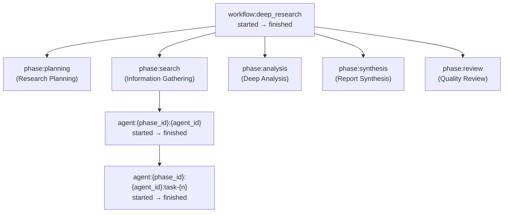

# Workflow Simulator - IVCAP Job Events Demo

This project simulates multi-agent workflows (like CrewAI or ChatGPT Deep Research) by emitting realistic IVCAP Job Events. It is designed to help develop and test frontend UX patterns against realistic event streams.

> **Optional UI:** There is a small React client in `client/` which can create a job via the IVCAP Jobs API and (best-effort) fetch the job's events for display.

## Inputs

- **preset_name** (required): Name of the workflow preset to run
  - `deep_research` - Multi-phase research workflow (Planning → Search → Analysis → Synthesis → Review)
  - `multi_agent_crew` - CrewAI-style with specialized agent roles
  - `simple_pipeline` - Basic 3-step sequential workflow for quick testing
- **timing_multiplier** (optional, default: 1.0): Scale factor for delays
  - `0.5` = 2x faster (good for testing)
  - `2.0` = 2x slower (more realistic feel)

## Outputs

- **message**: Success message on workflow completion
- **preset_name**: Name of the preset that was executed
- **phases_completed**: Number of phases completed
- **agents_executed**: Number of agents that executed
- **total_events**: Total number of events emitted
- **elapsed_seconds**: Total execution time in seconds

## Event Structure

Events are emitted hierarchically:

- `workflow:{name}` - Overall workflow start/complete
- `phase:{phase_id}` - Phase start/complete (e.g., `phase:research`)
- `agent:{phase_id}:{agent_id}` - Agent start/complete (e.g., `agent:research:web_searcher`)
- `agent:{phase_id}:{agent_id}:task-{n}` - Individual task updates

## Example: `deep_research` workflow (Mermaid)

The simulator emits **started** and **finished** events for each `step_id` below (via `JobContext.report.step_started(...)` / `step_finished(...)`).



## Expected Behaviour

1. The service loads the specified preset from `presets/{preset_name}.json`
2. For each **phase** in the workflow:
   - Emit `phase:{id}:started` event
   - Wait a random delay within the phase's `delay_range_ms`
   - Execute all **agents** in the phase:
     - Emit `agent:{phase}:{agent}:started` event
     - For each **task**, emit task status events with random delays
     - Emit `agent:{phase}:{agent}:completed` event
   - Emit `phase:{id}:completed` event
3. Return summary statistics on workflow completion

## Adding Custom Presets

Create a new JSON file in `presets/` following this schema:

```json
{
  "name": "my_workflow",
  "description": "Description of the workflow",
  "phases": [
    {
      "id": "phase_id",
      "name": "Phase Display Name",
      "delay_range_ms": [500, 2000],
      "agents": [
        {
          "id": "agent_id",
          "name": "Agent Display Name",
          "tasks": ["Task 1 message...", "Task 2 message..."],
          "delay_range_ms": [1000, 3000]
        }
      ]
    }
  ]
}
```

## Optional: Web Client (`client/`)

The `client/` folder contains a small React/Vite UI used to demo the workflow simulator via the **IVCAP Jobs API**:

- Creates a job: `POST /1/services2/{service_urn}/jobs`
- Polls job status: `GET /1/services2/{service_urn}/jobs/{job_id}`
- Fetches job events (best-effort): `GET /1/services2/{service_urn}/jobs/{job_id}/events`

> **Note:** The exact response format for `GET .../jobs/{job_id}/events` is **not yet confirmed** in this repo (I haven't received a successful response yet). It may be a JSON payload, or it may be an SSE `text/event-stream` response. The client function `subscribeToJobEvents` currently does best-effort parsing and will likely need updating once we confirm the real wire format.

### Prerequisites

- Node.js 20+
- `pnpm`
- A deployed Workflow Simulator service on IVCAP (you need its **service URN**)
- An IVCAP access token (Bearer token) if required by your environment

### Run the client

From the repo root:

```bash
cd client
pnpm install

# Configure env (see Configuration below), then:
pnpm dev
```

### Configuration

The UI is configured via Vite env vars:

- `VITE_API_URL`: IVCAP base URL (defaults to `https://develop.ivcap.net`)
- `VITE_SERVICE_URN`: Workflow Simulator service URN (defaults to a demo URN in code)
- `VITE_AUTH_TOKEN`: Bearer token (optional in code, but typically required for non-public IVCAP endpoints)

### Run the client locally to see the events:

```
poetry ivcap job-exec tests/request.json -- --stream --raw-events
```

### Note about local runs

Running the tool locally (e.g. `poetry ivcap run -- --port 8078`) is great for validating the simulator logic and response payload, but the `client/` UI is currently written against the **IVCAP platform Jobs API** (not the local `POST /` tool endpoint), so it will not display local job events unless you provide an IVCAP-compatible Jobs API in front of it.
